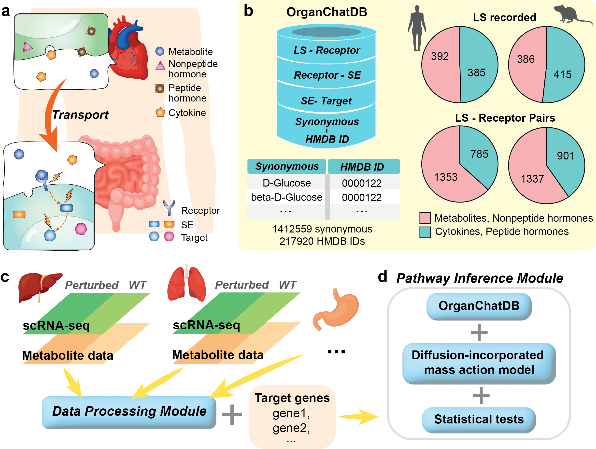

<!-- README.md is generated from README.Rmd. Please edit that file -->

# OrganChat: inferring organ-organ communication through single-cell data

OrganChat is a computational method that uses single-cell multi-modal data together with a newly constructed long-range signal (LS)-mediated communication database (OrganChatDB) to infer organ-organ communications. 

## Installation

You can install the development version of OrganChat from [GitHub](https://github.com/) with:

``` r
# install.packages("devtools")
devtools::install_github("ChanghanGitHub/OrganChat")
```

## Overview



OrganChatDB integrates LS-receptor signaling, receptor-SE interactions, and SE-target regulations for both human and mouse, as well as a dictionary linking HMDB IDs to metabolite synonyms. In total, the database catalogs 777 and 801 distinct LS molecules -- encompassing metabolites, peptide and nonpeptide hormones, and cytokines -- for human and mouse, respectively (Fig. 1a-b). The standard OrganChat workflow consists of three key modules: (1) Data processing module; (2) OOC inference module; (3) Multi-scale analysis module.

## Examples

### Application to a five-organ communication system for immune-mediated diseases:[link to the folder](Example/Sandra_CellRepMed_2023)

(1) [Processing the original data and inferring metabolite flux.](Example/Sandra_CellRepMed_2023/HSandra_CellRepMed_2023_DataProcessing_MetaboliteAnalysis.Rmd)

(2) [Comparison analysis via OrganChat between conditions for: joint and muscle; joint and spleen; muscle and spleen; skin and muscle.](Example/Sandra_CellRepMed_2023/HumanAtlas_Science_2022_MetaboliteAnalysis.Rmd)

(3) [Multi-organ OrganChat (MOOC) Analysis of OrganChat between conditions for: joint, muscle, lung, skin, spleen.](Example/Sandra_CellRepMed_2023/HumanAtlas_Science_2022_Multi-OrganAnalysis.Rmd)

### OrganChat reveals cross-organ communication for human multiple-disease systems: [link to the folder](Example/HumanAtlas_Science_2022)

(1) [Processing the original data.](Example/HumanAtlas_Science_2022/HumanAtlas_Science_2022_DataProcessing.Rmd)

(2) [Inferring metabolite flux data.](Example/HumanAtlas_Science_2022/HumanAtlas_Science_2022_MetaboliteAnalysis.Rmd)

(3) [Multi-organ OrganChat analysis between spleen, small intestine, lymph node, lung, and vasculature.](Example/HumanAtlas_Science_2022/HumanAtlas_Science_2022_Multi-OrganAnalysis.Rmd)

(4) [Comparison analysis between two donors for: small intestine and vasculature, lung and vasculature, lymph node and vasculature, respectively.](Example/HumanAtlas_Science_2022/HumanAtlas_Science_2022_ComparisonAnalysis.Rmd)
